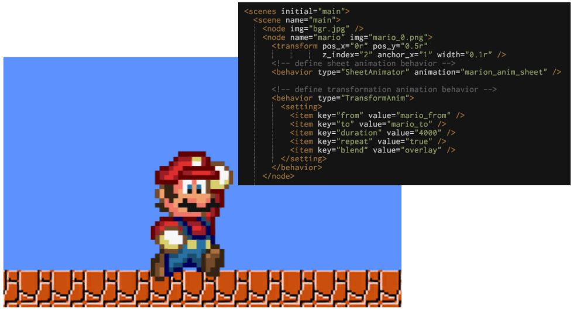
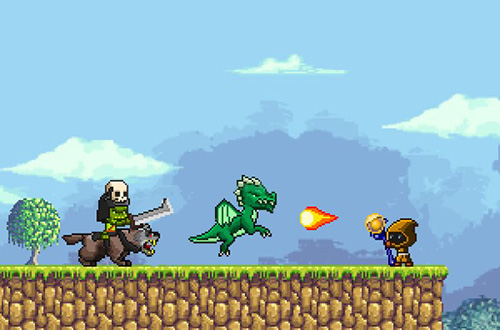
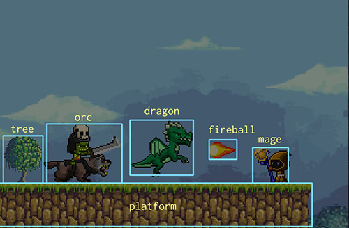

ofxCogEngine
===================

## What's the CogEngine?

CogEngine stands for C++ component-oriented game engine. It can be used as a tool for creating 2D windows or mobile games. It is implemented as an [OpenFrameworks](http://openframeworks.cc) addon. 

**Budget**: over 600 working hours

## Platforms
* Windows
* Linux
* Android

## Features
* Scene graph
* ECS pattern (messaging, generic attributes, flags, behaviors, components)
* Animations
* Finite state machines
* Goal-driven behavior components
* Steering behaviors
* Monte-Carlo tree search 
* A* Path-finding
* SQLite database
* Custom networking protocol for multiplayer
* XML and JSON parsers for certain components
* Lua scripting language

## Projects
* <a href="https://github.com/dormantor/Hydroq" target="_blank">Hydroq</a>
* <a href="https://github.com/dormantor/Paratrooper" target="_blank">Paratrooper clone</a>
* <a href="https://github.com/dormantor/Arkanoid" target="_blank">Arkanoid clone</a>

## How to use it
* [Tutorial](Docs/tutorial.md) - getting started
* [Architecture](Docs/architecture.md) - brief description of the architecture

## Component Architecture
* The whole game is made of components
* <code>Component</code> is an entity that defines functional behavior for the whole application or its part (is not attached to any game object)
* <code>Behavior</code> is a component that is attached to a game object, defining its functionality
* <code>Node</code> is a part of scene graph, represents a single entity (usually a game object)
* <code>Attribute</code> is a generic attribute, kept in a collection the Node has a reference to
* **The overall behavior of a particular game object is determined by the aggregation of its behaviors and attributes**

## Component Architecture Example

Scene

Objects

Component architecture

## Compatibility

Works with OpenFrameworks 0.9.8

## LICENSE and ATTRIBUTIONS

ofxCogEngine is made available under the [MIT](http://opensource.org/licenses/MIT) license.
ofxCogEngine bundles catch framework, lua scripting language, luabridge binder, sqlite and following OpenFrameworks addons: ofxNetwork, ofxSQLite, ofxTextLabel, ofxXmlSettings